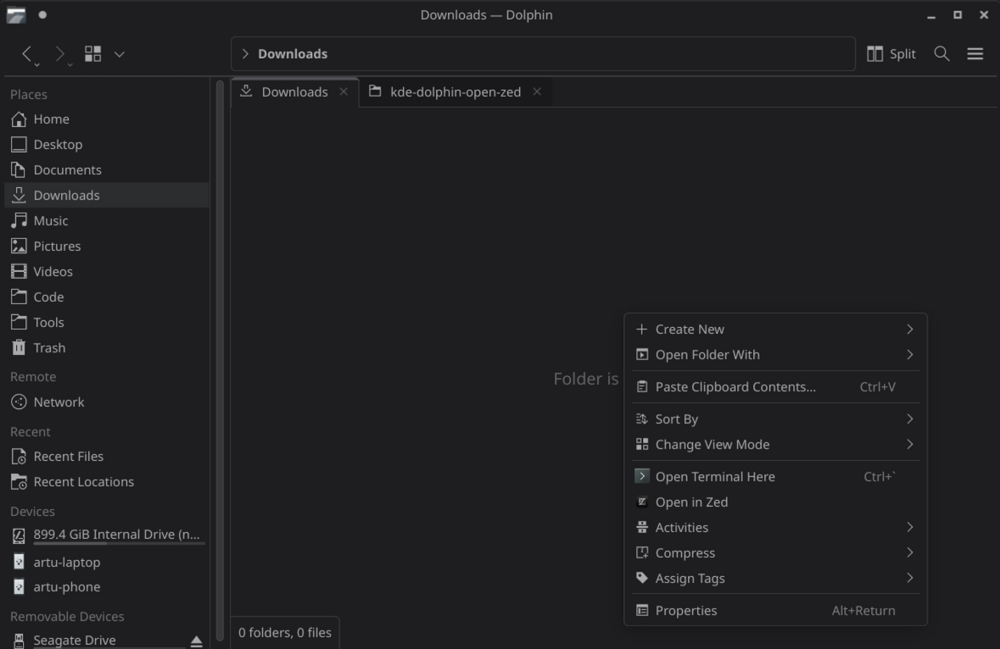

# Dolphin: Open in Zed
Add context menu to Dolphin to easily open Zed at location on right click. 

Inspired by [Merrit/kde-dolphin-open-vscode](https://github.com/Merrit/kde-dolphin-open-vscode)

## How to install

Execute the following command to make the install script executable:

```bash
chmod +x install.sh
```

Then execute the install script:

```bash
./install.sh
```

If you have a custom Zed installation, use the `--app-dir` option to specify the path to the Zed executable:

```bash
./install.sh --app-dir /path/to/zed
```

## Customization

By default, the extension works only on directories. If you want to enable it on files as well, edit the `openInZed.desktop` file and change the `MimeType` line to `all/all` or `inode/directory;{your_type}`.

## Screenshot


